# NPCL Voice Assistant - System Architecture

## Overview

The NPCL Voice Assistant is a real-time voice-to-voice conversational AI system designed for customer service applications. It leverages OpenAI's Realtime API to provide natural, empathetic customer support for power utility services.

## High-Level Architecture

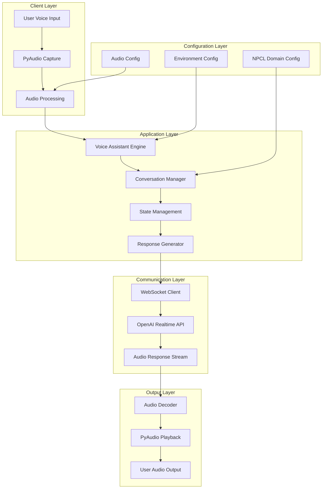

## Core Components

### 1. Audio Processing Engine

**Purpose**: Handles real-time audio capture, processing, and playback

**Key Features**:
- PCM16 audio format at 24kHz sample rate
- 1024-byte chunk processing for optimal latency
- Mono channel audio for telephony compatibility
- Real-time audio buffering with queue management

**Implementation**:
```python
# Audio Configuration
sample_rate = 24000
chunk_size = 1024
channels = 1
format = pyaudio.paInt16
```

**Components**:
- **Audio Input Handler**: Captures microphone input
- **Audio Output Handler**: Manages speaker output
- **Audio Queue Manager**: Buffers audio data
- **Format Converter**: Handles audio format conversions

### 2. WebSocket Communication Layer

**Purpose**: Manages real-time bidirectional communication with OpenAI

**Architecture**:
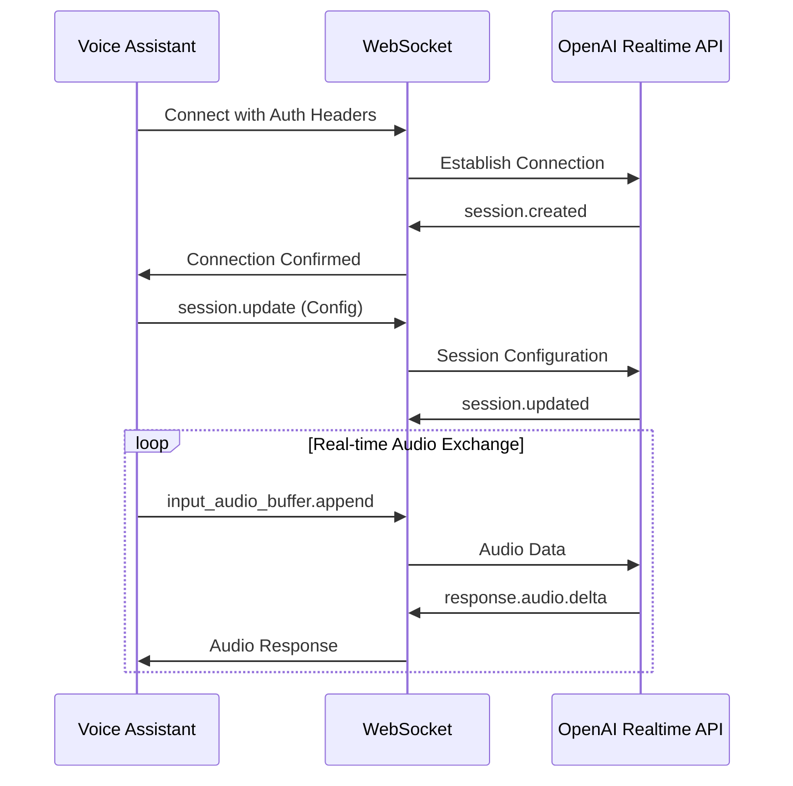

**Key Features**:
- Persistent WebSocket connection with auto-reconnection
- Event-driven message handling
- Base64 audio encoding/decoding
- Error handling and recovery mechanisms

### 3. Conversation Management System

**Purpose**: Manages conversation flow, state, and context

**State Machine**:
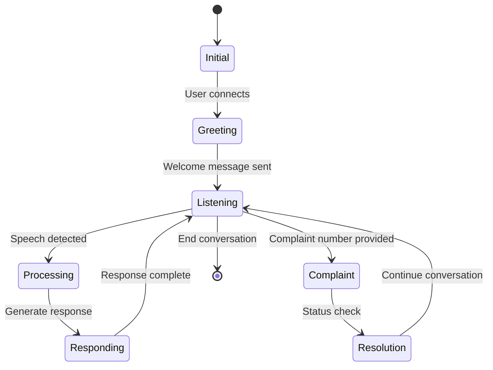

**Components**:
- **State Manager**: Tracks conversation state
- **Context Manager**: Maintains conversation history
- **Intent Recognition**: Identifies customer needs
- **Response Orchestrator**: Coordinates appropriate responses

### 4. NPCL Domain Logic

**Purpose**: Implements NPCL-specific business logic and conversation patterns

**Domain Model**:
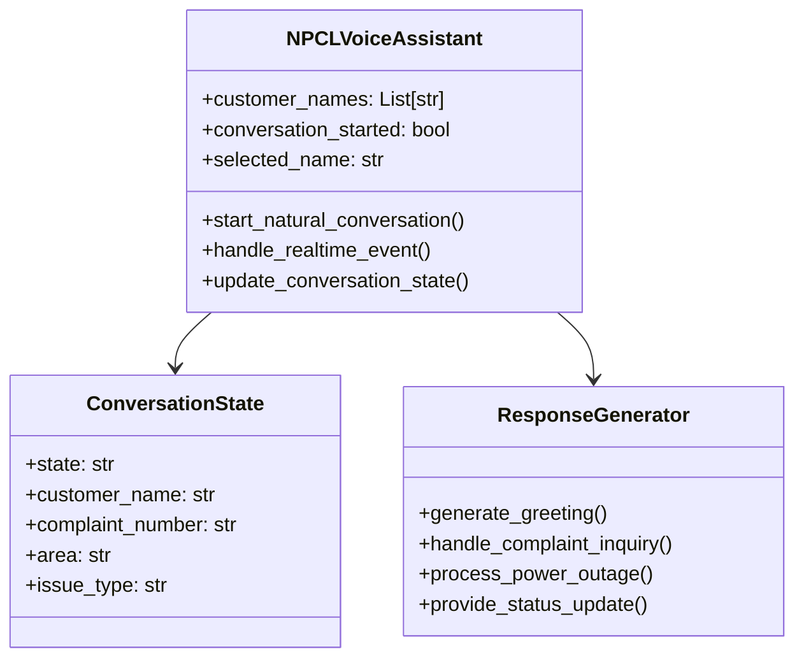

## Data Flow Architecture

### Audio Processing Pipeline


### Event Processing Flow

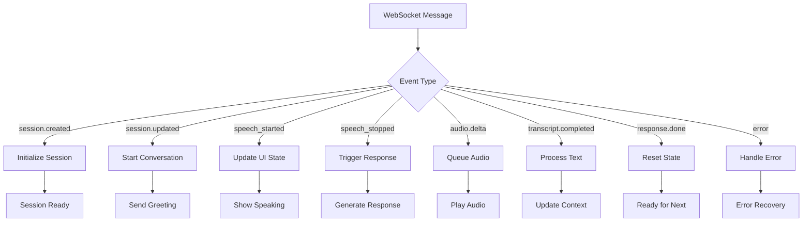

## Technical Stack

### Core Technologies

| Component | Technology | Version | Purpose |
|-----------|------------|---------|---------|
| Runtime | Python | 3.13.7 | Main application runtime |
| AI API | OpenAI Realtime API | v1 | Voice-to-voice AI processing |
| Audio | PyAudio | 0.2.11+ | Audio I/O operations |
| Networking | WebSockets | 12.0+ | Real-time communication |
| Async | asyncio | Built-in | Concurrent operations |
| UI | Colorama | 0.4.6+ | Terminal output formatting |
| Config | python-dotenv | 1.0.0+ | Environment management |

### Audio Processing Stack

```mermaid
graph LR
    subgraph "Audio Input"
        A[Hardware Microphone] --> B[System Audio Driver]
        B --> C[PyAudio Interface]
    end
    
    subgraph "Processing"
        C --> D[PCM16 Format]
        D --> E[24kHz Sample Rate]
        E --> F[1024-byte Chunks]
        F --> G[Base64 Encoding]
    end
    
    subgraph "Transmission"
        G --> H[WebSocket Protocol]
        H --> I[OpenAI Realtime API]
    end
    
    subgraph "Response"
        I --> J[Audio Response]
        J --> K[Base64 Decoding]
        K --> L[Audio Queue]
        L --> M[Speaker Output]
    end
```

## Deployment Architecture

### Development Environment

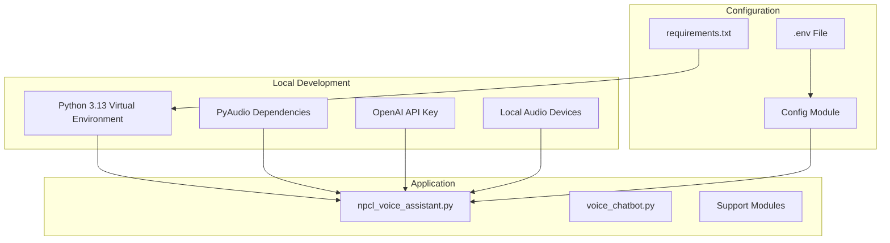

### Production Considerations

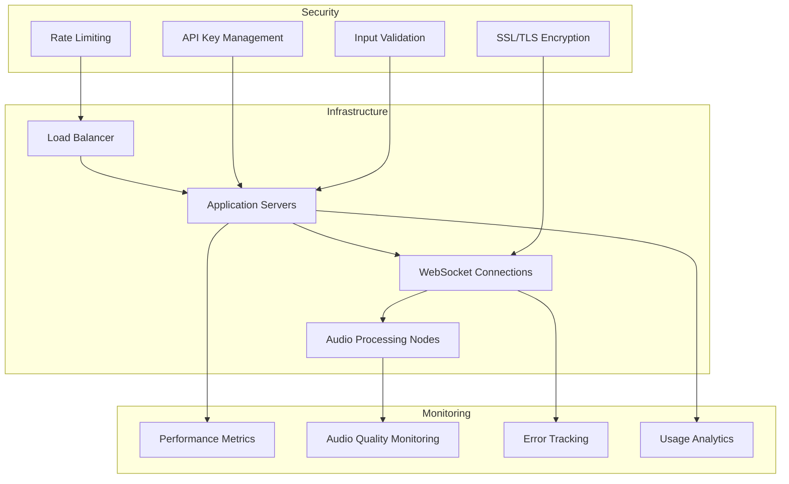

## Performance Architecture

### Latency Optimization

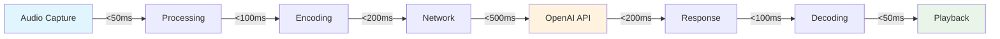

### Concurrency Model

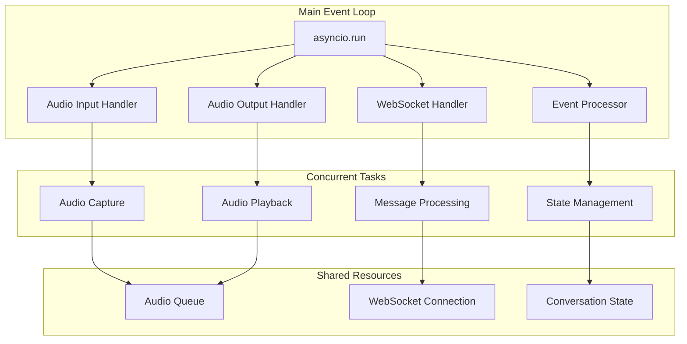

## Security Architecture

### Data Protection

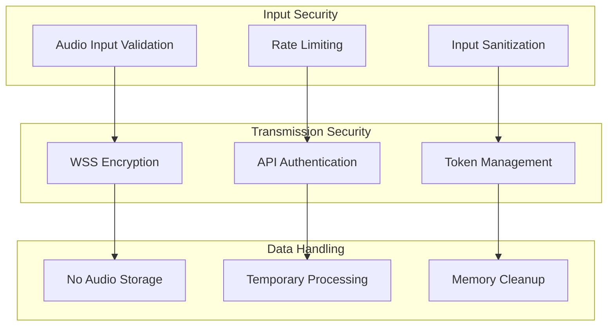

### Authentication Flow

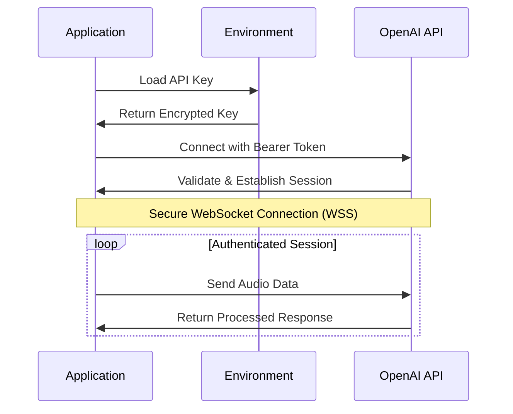

## Error Handling Architecture

### Error Recovery Strategy

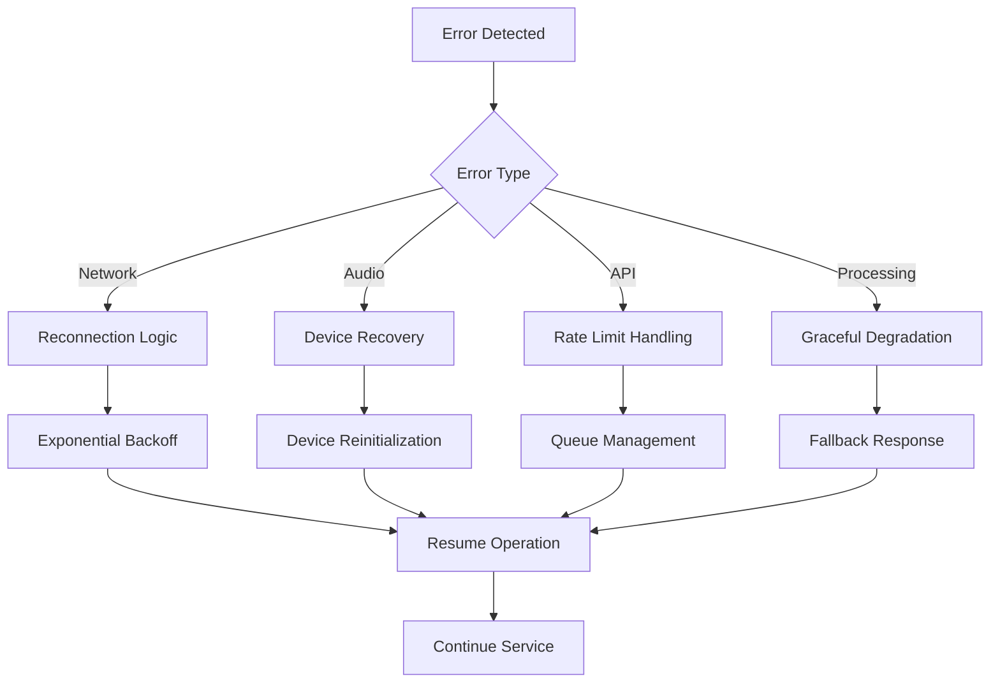

### Monitoring and Logging

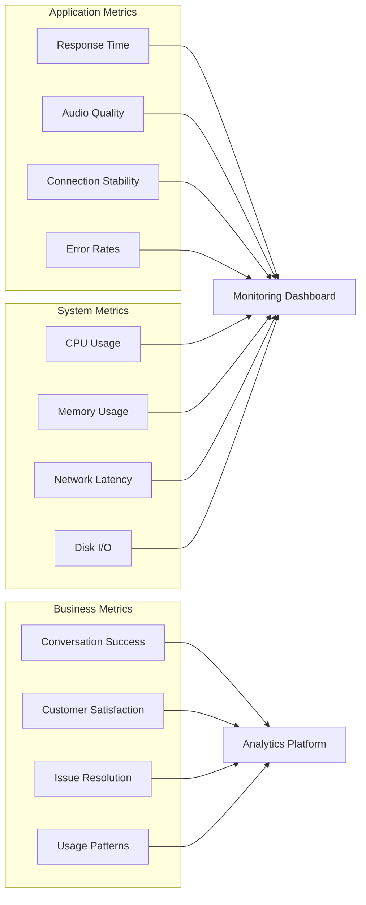

## Scalability Considerations

### Horizontal Scaling

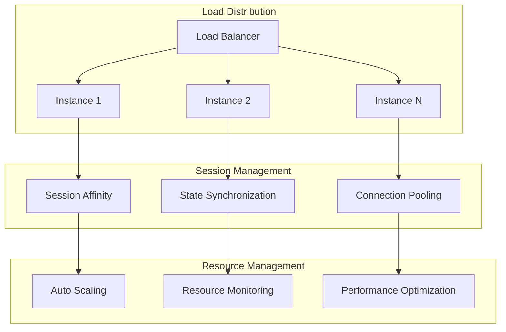

### Future Architecture Enhancements

1. **Multi-Language Support**
   - Language detection and routing
   - Locale-specific voice models
   - Cultural adaptation layers

2. **Advanced Analytics**
   - Real-time conversation analytics
   - Sentiment analysis integration
   - Performance optimization insights

3. **Integration Capabilities**
   - CRM system integration
   - Telephony system connectivity
   - Third-party service APIs

4. **Enhanced AI Features**
   - Custom model fine-tuning
   - Domain-specific knowledge bases
   - Advanced conversation flows

This architecture provides a robust, scalable foundation for real-time voice AI applications while maintaining high performance and reliability standards.